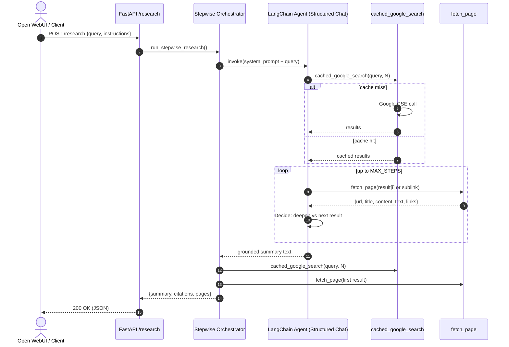

## AI Researcher OpenAPI Tool Server

Production-ready FastAPI server implementing the Open WebUI OpenAPI servers spec as a single tool that performs structured web research using LangChain, Google CSE, and OpenRouter (Gemini 2.5 Pro).

### Features
- /research endpoint accepting a topic and optional instructions
- Stepwise LLM-directed crawl loop with a single TTL-cached Google search
- Page parsing with content extraction and up to 5 in-site hyperlinks per step
- Structured JSON output designed for LLM consumption

### Requirements
- Python 3.10+
- API keys:
  - `GOOGLE_API_KEY` and `GOOGLE_CSE_ID` for Google Custom Search
  - `OPENROUTER_API_KEY` for OpenRouter

### Quickstart
```bash
# From repository root
python3 -m venv .venv
source .venv/bin/activate
pip install -U pip
pip install -r requirements.txt

# Run the server
uvicorn app.main:app --host 0.0.0.0 --port 8000
```

### .env file
Create a `.env` file in the project root:
```env
GOOGLE_API_KEY=your_google_api_key
GOOGLE_CSE_ID=your_google_cse_id
OPENROUTER_API_KEY=your_openrouter_api_key
# optional
API_TOKEN=your_bearer_token
OPENROUTER_BASE_URL=https://openrouter.ai/api/v1
REQUEST_TIMEOUT_SECONDS=15
LLM_TIMEOUT_SECONDS=25
AGENT_MAX_STEPS=6
SEARCH_TTL_SECONDS=900
USER_AGENT=AI-Researcher/0.1
```
`.env` is loaded automatically at startup. If `API_TOKEN` is set, all endpoints require header `Authorization: Bearer <API_TOKEN>`.

### Docker
- Build and run with Docker (loads `.env` into the container):
  ```bash
  docker build -t ai-researcher:latest .
  docker run --rm -p 8000:8000 --env-file .env ai-researcher:latest
  ```
- Or via docker-compose (uses `env_file: .env`):
  ```bash
  docker compose up --build
  ```

### Environment Variables
- `GOOGLE_API_KEY`: Google API key for Custom Search
- `GOOGLE_CSE_ID`: Google Custom Search Engine ID
- `OPENROUTER_API_KEY`: OpenRouter API key
- `API_TOKEN` (optional): If present, required Bearer token for all requests
- `OPENROUTER_BASE_URL` (optional): Default `https://openrouter.ai/api/v1`
- `REQUEST_TIMEOUT_SECONDS` (optional): Default 15
- `LLM_TIMEOUT_SECONDS` (optional): Default 25
- `AGENT_MAX_STEPS` (optional): Default 6
- `SEARCH_TTL_SECONDS` (optional): Default 900
- `USER_AGENT` (optional): Custom UA for fetches

### API
- POST `/research`
  - Headers (if `API_TOKEN` set): `Authorization: Bearer <API_TOKEN>`
  - Body:
    ```json
    {
      "query": "What is RAG?",
      "instructions": "Focus on production practices",
      "max_search_results": 5
    }
    ```
  - Response: Structured JSON with summary, citations, and page data suitable for LLMs.

Curl example with auth:
```bash
curl -s http://localhost:8000/research \
  -H "Content-Type: application/json" \
  -H "Authorization: Bearer $API_TOKEN" \
  -d '{"query":"Impact of climate change on polar bears","max_search_results":5}'
```

Open WebUI:
- When adding your tool server, include the header `Authorization: Bearer <API_TOKEN>` in the server config (if the UI supports per-tool headers), or configure a proxy that injects it.

### Response format
- Status: 200 OK
- Content-Type: application/json
- Body shape:
  - **topic** (string): Original query.
  - **summary** (string): Grounded synthesis written by the LLM from fetched content.
  - **citations** (array of objects): Search results used as references.
    - **url** (string): Source URL.
    - **title** (string|null): Source title when available.
    - **snippet** (string|null): Short snippet/preview from search.
  - **pages** (array of objects): Parsed pages returned by the service for downstream LLM consumption.
    - **url** (string): Page URL.
    - **title** (string|null): Parsed/short title.
    - **content_text** (string|null): Readability-extracted main text.
    - **links_followed** (array of strings|null): In-site links chosen during parsing; may be absent or limited.
    - **metadata** (object|null): Reserved for future use.

Example:
```json
{
  "topic": "Compare vector databases for RAG in production",
  "summary": "(Grounded synthesis referencing parsed sources)...",
  "citations": [
    {"url": "https://example.com/..", "title": "...", "snippet": "..."},
    {"url": "https://vendor.com/rag-guide", "title": "RAG guide", "snippet": "..."}
  ],
  "pages": [
    {
      "url": "https://example.com/..",
      "title": "Example article",
      "content_text": "Longer extracted article text...",
      "links_followed": ["https://example.com/pricing", "https://example.com/perf"],
      "metadata": null
    }
  ]
}
```

### How it works (Stepwise LLM + Tools)
- **Entry (Open WebUI)**: A user query is POSTed to `/research`.
- **Single cached search**: The system calls `cached_google_search` once per request (TTL cache) to get top N results.
- **LLM-controlled crawl loop (max steps)**:
  1. Start at the first Google result. Call `fetch_page(url)` to extract content and in-site links.
  2. The LLM decides based on the page content:
     - If the page likely contains the answer, optionally deepen by calling `fetch_page` on a few in-site links.
     - If the page likely does not contain the answer, move to the next Google result.
  3. Continue until the LLM is confident it can answer or until reaching the configured max steps.
- **Summary and output**: The LLM produces a concise, grounded summary. The server composes citations (from cached search) and includes parsed pages for downstream LLMs.

### Tools available to the agent
- **cached_google_search(query, max_results<=5)**: Returns Google CSE results with TTL caching. Intended to be called ONCE per research.
- **fetch_page(url)**: Returns `{ url, title, content_text, links }` where `links` are up to 5 in-site hyperlinks.

### How `fetch_page` works (internals)
- Performs an HTTP GET with a polite timeout and custom UA.
- Uses readability-based extraction to isolate the main article content and title.
- Parses HTML with lxml/BeautifulSoup to gather in-site hyperlinks (non-javascript, non-fragment), normalized and de-duplicated, up to 5.
- Returns structured data for the LLM to reason over and decide on next steps.

### Visual overview (Mermaid)



```mermaid
flowchart TD
    A[Start] --> B[Get cached_google_search results (TTL)]
    B --> C[Set i = 1; steps = 0]
    C --> D[fetch_page(results[i])]
    D --> E{Answer on page?}
    E -- Yes --> F[Summarize and stop]
    E -- No, but relevant --> G[Deepen: choose a few in-site links]
    G --> H[fetch_page(link) ...]
    H --> I[steps += num_calls]
    I --> J{steps >= MAX_STEPS?}
    J -- Yes --> F
    J -- No --> E
    E -- No, irrelevant --> K{i += 1}
    K --> L{i <= N results?}
    L -- Yes --> D
    L -- No --> F[Summarize (best-effort) and stop]
```

### Example walkthrough (from real logs)
- Query: "Стендап лучших комиков в Москве на 1 сентября" (instructions: "Нужно купить билеты").
- Search results (top 5):
  1. `https://kudamoscow.ru/event/all/1-09-2024/`
  2. `https://afisha.yandex.ru/moscow/selections/standup`
  3. `https://kudamoscow.ru/event/all/1-09-2023/`
  4. `https://standupstore.ru/`
  5. `https://moscowstandupshow.ru/`
- Stepwise crawl (partial):
  - fetch_page 1: `kudamoscow.ru/.../1-09-2024/` → title parsed; 5 in-site links
  - LLM deepens on relevant ticket pages (e.g., `msk.kassir.ru`, `afisha.yandex.ru`), then proceeds to more results as needed
  - Stops once confident; returns grounded summary + citations + parsed page(s)

### Add this server to Open WebUI
- Start this server and ensure it’s reachable (e.g., `http://localhost:8000`).
- In Open WebUI:
  - Go to Settings → Tools → Add OpenAPI Tool Server.
  - Enter your server base URL or the OpenAPI URL: `http://localhost:8000/openapi.json`.
  - Increase tool Timeout (ms) if you want deeper research (e.g., 120000–300000).
  - If `API_TOKEN` is set, configure the tool server to send header `Authorization: Bearer <API_TOKEN>`.
  - Save. Open WebUI will ingest the schema and expose the `/research` tool.

### OpenAPI
FastAPI auto-exposes OpenAPI at `/openapi.json` for Open WebUI integration.

### Notes
- The search call is cached for TTL; multiple tool calls reuse the same results.
- Depth is LLM-directed but capped by a global max-steps guard for cost control.
- Consider raising Open WebUI tool timeout if your research depth is high.
- For stricter compliance, add robots.txt checks.
